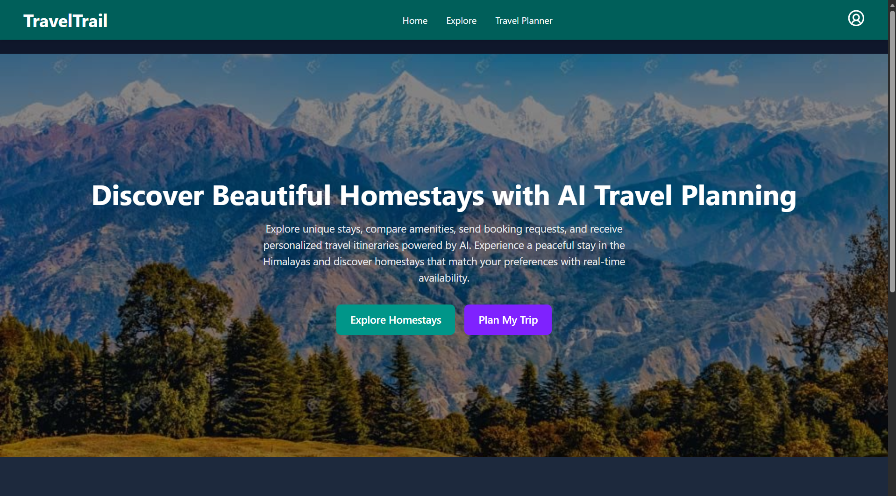
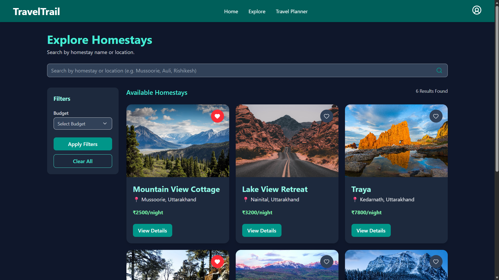
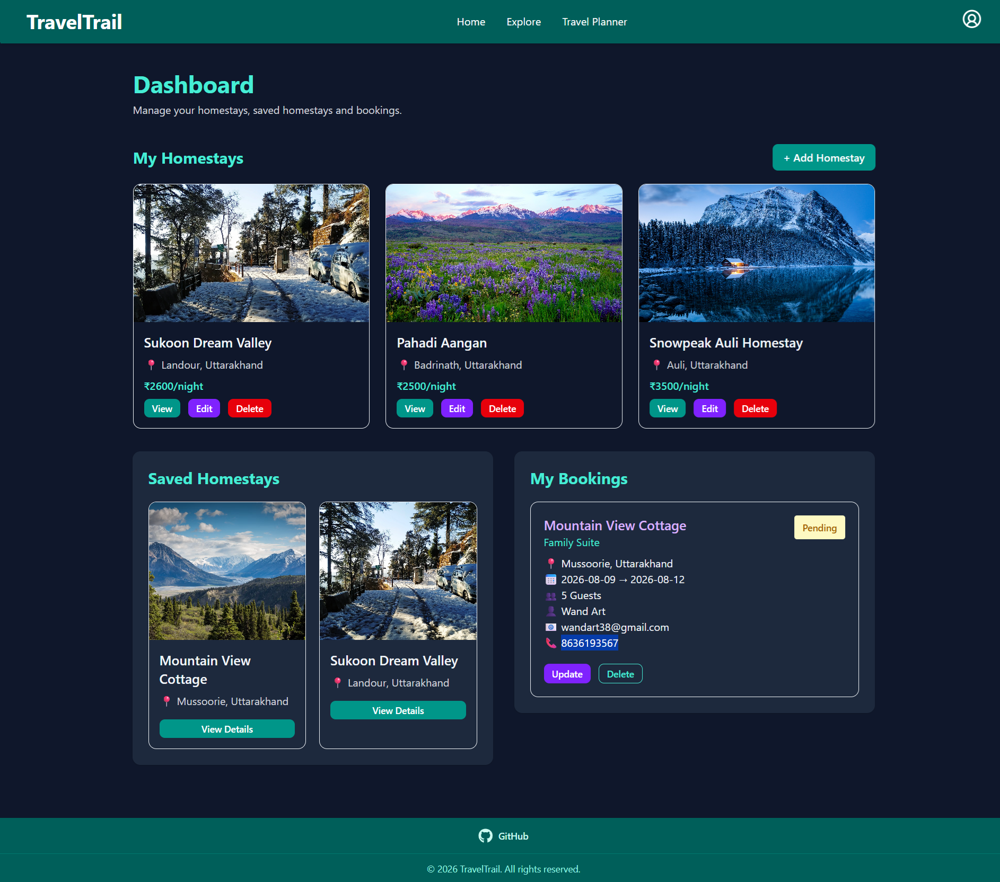
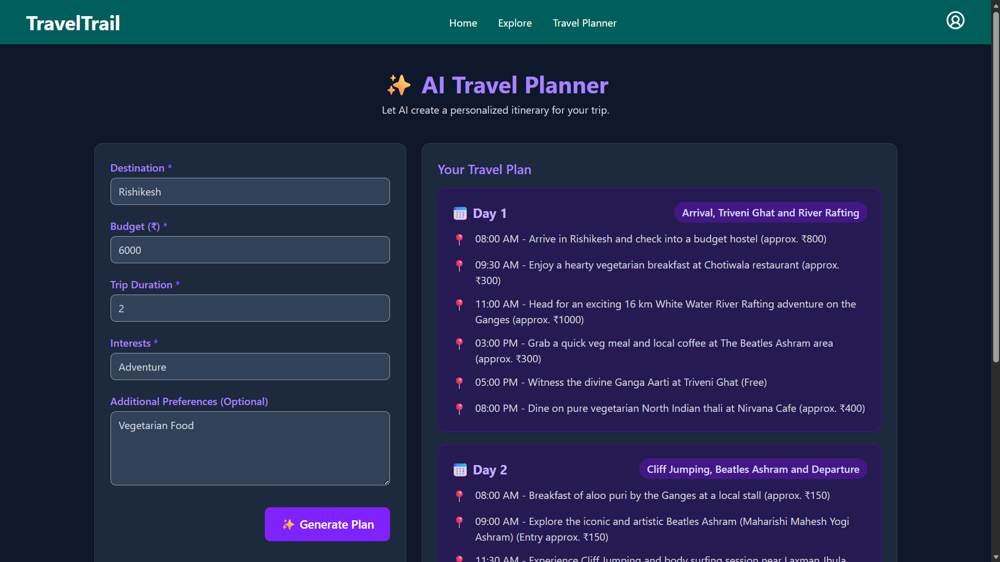

# TravelTrail: AI-Assisted Homestay & Travel Planner

An AI-assisted homestay booking and travel planning platform that enables travelers to discover homestays, manage bookings, save favorites, and generate personalized travel plans using Google's Gemini AI.

## 🚀 Live Application

👉 **Open TravelTrail:**  
https://travel-trail-ai-assisted-homestay-t.vercel.app

---

## 📸 Screenshots

### Home Page



### Explore Page



### User Dashboard



### AI Travel Planner



---

## ✨ Features

- Browse available homestays
- View detailed homestay information
- Search homestays by name, location, and budget
- View available rooms and amenities
- Create, update, view, and delete bookings
- Save and manage favorite homestays
- Manage homestay listings through create, update, and delete operations
- User authentication using JWT and Google OAuth
- AI-powered Travel Planner using Google Gemini
- Personalized day-wise travel plans
- Budget-aware travel recommendations
- Personalized user dashboard

---

## 🛠️ Tech Stack

### Frontend

- React.js (Vite)
- Tailwind CSS
- Fetch API
- React Router
- Lucide React Icons

### Backend

- FastAPI (Python)
- Uvicorn
- Python-dotenv
- CORS Middleware
- JWT Authentication
- Google OAuth

### Database

- MongoDB Atlas
- PyMongo

### AI

- Google Gemini API

### Deployment

- Frontend: Vercel
- Backend: Render
- Database: MongoDB Atlas
- AI: Google Gemini API

---

## 🤖 AI Integration

TravelTrail integrates Google's Gemini API to generate personalized travel plans.

The AI Travel Planner allows users to:

- Enter a destination
- Specify their budget
- Choose trip duration
- Select travel interests
- Add optional travel preferences

The backend securely communicates with Google's Gemini API using environment variables to protect sensitive credentials. The AI-generated response is validated before being returned to the frontend, where it is displayed as a personalized day-wise travel plan.

---

## ⚙️ Setup Instructions

### 1. Clone the Repository

```bash
git clone https://github.com/NavneetF26/TravelTrail-AI-Assisted-Homestay-Travel-Planner.git
cd TravelTrail-AI-Assisted-Homestay-Travel-Planner
```

### 2. Set Up MongoDB Atlas

TravelTrail uses MongoDB Atlas as its database.

1. Create a MongoDB Atlas cluster.
2. Create a database user.
3. Allow your IP address to access the cluster.
4. Copy the MongoDB connection string.
5. Use the connection string as the value of `MONGO_URI` in the backend `.env` file.

### 3. Backend Setup

Navigate to the backend directory:

```bash
cd backend
```

Create a virtual environment:

```bash
python -m venv venv
```

Activate the virtual environment.

**Windows:**

```bash
venv\Scripts\activate
```

**macOS/Linux:**

```bash
source venv/bin/activate
```

Install the required dependencies:

```bash
pip install -r requirements.txt
```

### 4. Configure Environment Variables

Create a `.env` file inside the `backend` folder using `.env.example` as a reference.

```env
MONGO_URI=your_mongodb_connection_string

JWT_SECRET=your_secret_key
JWT_ALGORITHM=HS256
ACCESS_TOKEN_EXPIRE_DAYS=7

GOOGLE_CLIENT_ID=your_google_client_id
GOOGLE_CLIENT_SECRET=your_google_client_secret

SESSION_SECRET=your_session_secret

GEMINI_API_KEY=your_gemini_api_key

FRONTEND_URL=http://localhost:5173
```

Do not commit the `.env` file to the repository.

Start the backend server:

```bash
uvicorn app.main:app --reload
```

The backend will run at:

```text
http://localhost:8000
```

### 5. Frontend Setup

Open a new terminal and navigate to the frontend directory:

```bash
cd frontend
```

Install dependencies:

```bash
npm install
```

Start the development server:

```bash
npm run dev
```

The frontend will run at:

```text
http://localhost:5173
```

### 6. API Documentation

Once the backend is running, interactive Swagger API documentation is available at:

```text
http://localhost:8000/docs
```

---

## 🗄️ Database

TravelTrail uses **MongoDB Atlas** as its primary database.

MongoDB was chosen because its document-based structure works well with the project's nested data, such as rooms, amenities, images, and nearby attractions.

### Collections

- **users** – Stores user profile information and authentication details.
- **homestays** – Stores homestay details, rooms, amenities, images, and nearby attractions.
- **bookings** – Stores booking details, guest information, travel dates, and booking status.
- **saved_homestays** – Stores users' saved or favorite homestays.

---

## 📊 Database Schema


---

## 📡 API Documentation

TravelTrail's backend is built with FastAPI.

When running locally, interactive Swagger API documentation is available at:

```text
http://localhost:8000/docs
```

### Homestays

| Method | Endpoint                       | Description             |
| ------ | ------------------------------ | ----------------------- |
| GET    | `/api/homestays/`              | Get available homestays |
| POST   | `/api/homestays/`              | Create a homestay       |
| GET    | `/api/homestays/search`        | Search homestays        |
| GET    | `/api/homestays/{homestay_id}` | Get a specific homestay |
| PUT    | `/api/homestays/{homestay_id}` | Update a homestay       |
| DELETE | `/api/homestays/{homestay_id}` | Delete a homestay       |

### Bookings

| Method | Endpoint                     | Description            |
| ------ | ---------------------------- | ---------------------- |
| GET    | `/api/bookings/`             | Get bookings           |
| POST   | `/api/bookings/`             | Create a booking       |
| GET    | `/api/bookings/{booking_id}` | Get a specific booking |
| PUT    | `/api/bookings/{booking_id}` | Update a booking       |
| DELETE | `/api/bookings/{booking_id}` | Delete a booking       |

### Saved Homestays

| Method | Endpoint                   | Description             |
| ------ | -------------------------- | ----------------------- |
| POST   | `/api/saved/{homestay_id}` | Save a homestay         |
| DELETE | `/api/saved/{homestay_id}` | Remove a saved homestay |
| GET    | `/api/saved/`              | Get saved homestays     |

### AI Planner

| Method | Endpoint              | Description                            |
| ------ | --------------------- | -------------------------------------- |
| POST   | `/api/ai/travel-plan` | Generate a personalized AI travel plan |

### Authentication

| Method | Endpoint                    | Description                  |
| ------ | --------------------------- | ---------------------------- |
| POST   | `/api/auth/register`        | Register a new user          |
| POST   | `/api/auth/login`           | Log in a user                |
| GET    | `/api/auth/google/login`    | Start Google OAuth login     |
| GET    | `/api/auth/google/callback` | Handle Google OAuth callback |
| POST   | `/api/auth/logout`          | Log out the current user     |

### API Examples

#### Create Booking

**Request**

```http
POST /api/bookings/
```

**Request Body**

```json
{
  "homestay_id": 1,
  "room_id": 1,
  "full_name": "Test User",
  "email": "test@example.com",
  "check_in": "2026-08-15",
  "check_out": "2026-08-17",
  "guests": 2,
  "phone": "9876543210"
}
```

**Response**

```json
{
  "message": "Booking created successfully",
  "booking": {
    "homestay_id": 1,
    "room_id": 1,
    "full_name": "Test User",
    "email": "test@example.com",
    "check_in": "2026-08-15",
    "check_out": "2026-08-17",
    "guests": 2,
    "status": "Pending"
  }
}
```

#### Generate AI Travel Plan

**Request**

```http
POST /api/ai/travel-plan
```

**Request Body**

```json
{
  "destination": "Mussoorie",
  "budget": "10000",
  "duration": "3 days",
  "interests": "nature, sightseeing",
  "preferences": "prefer peaceful places"
}
```

**Response**

```json
{
  "days": [
    {
      "day": "Day 1",
      "title": "Arrival and Local Exploration",
      "activities": ["Explore Mall Road", "Visit Landour", "Try local food"]
    }
  ]
}
```

> The AI-generated travel plan varies depending on the user's input.

---

## 🏗️ Architecture / Folder Structure

TravelTrail uses a separate frontend and backend architecture.

- **Frontend:** React.js application responsible for the user interface, routing, authentication state, and communication with backend APIs.
- **Backend:** FastAPI application responsible for REST APIs, authentication, business logic, and Gemini AI integration.
- **Database:** MongoDB Atlas stores users, homestays, bookings, and saved homestays.
- **AI:** Google Gemini API generates personalized travel plans.

### Project Structure

```text
TravelTrail-AI/
│
├── backend/
│   ├── app/
│   │   ├── models/
│   │   │   ├── booking.py
│   │   │   ├── homestay.py
│   │   │   └── user.py
│   │   │
│   │   ├── routes/
│   │   │   ├── auth.py
│   │   │   ├── bookings.py
│   │   │   ├── homestays.py
│   │   │   ├── planner.py
│   │   │   └── saved.py
│   │   │
│   │   ├── utils/
│   │   │   ├── auth.py
│   │   │   ├── error_handler.py
│   │   │   ├── oauth.py
│   │   │   └── rate_limiter.py
│   │   │
│   │   ├── database.py
│   │   └── main.py
│   │
│   ├── .env.example
│   └── requirements.txt
│
├── frontend/
│   ├── src/
│   │   ├── assets/
│   │   ├── components/
│   │   │   └── ui/
│   │   ├── context/
│   │   ├── pages/
│   │   ├── App.jsx
│   │   └── main.jsx
│   │
│   ├── .env.example
│
├── docs/
│   ├── schema.png
│   ├── home.png
│   ├── details.png
│   ├── dashboard.png
│   └── planner.png
│
├── .gitignore
├── PROMPTS.md
└── README.md
```

---

## ⚠️ Known Limitations

- The backend is hosted on **Render's free tier**, which automatically spins down after a period of inactivity.
- The first request after the backend has been idle may take approximately **30–60 seconds** while the server wakes up.
- Once awake, the application performs normally.
- Google Gemini API usage is subject to the limits of the configured API plan.
- The application is developed as an academic and internship project and is not intended for production-scale traffic.

---

## 🙏 Credits & Acknowledgements

- **Google Gemini API** – Used to generate personalized AI-powered travel plans.
- **React.js, FastAPI, MongoDB, Vercel, and Render documentation** – Used as technical references during development.
- **ChatGPT** – Used as a development assistance tool for debugging, implementation guidance, and documentation support.

---

## 📄 License

This project was developed for academic and internship purposes.
