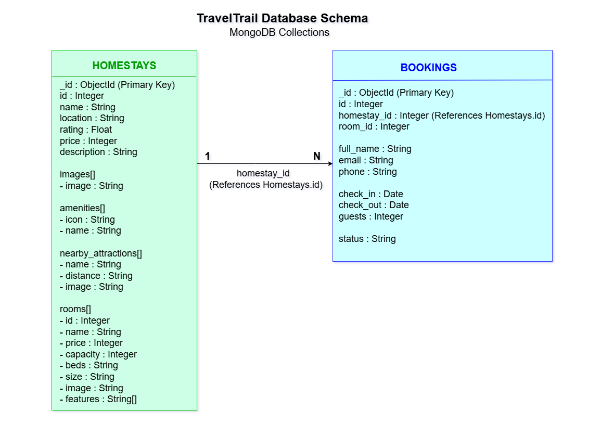

# TravelTrail: AI-Assisted Homestay & Travel Planner

An AI-assisted homestay booking and travel planning platform designed to help travelers explore homestay information, check room availability, submit booking requests, and plan their trips with AI assistance.

---

## Features

- Browse available homestays
- View detailed homestay information
- Search homestays by name, location, and budget
- View available rooms and amenities
- Create, update, view, and delete bookings
- AI Travel Planner (in progress)

---

## Tech Stack

### Frontend

- React.js
- Tailwind CSS
- Axios / Fetch API

### Backend

- FastAPI (Python)
- Uvicorn
- Python-dotenv
- CORS Middleware

### Database

- MongoDB Atlas
- PyMongo

---

## Frontend Setup (Run Locally)

```bash
cd frontend
npm install
npm run dev
```

Frontend will be running at:

`http://localhost:5173`

---

## Backend Setup (Run Locally)

**Step 1 — Create a virtual environment**

```bash
python -m venv venv
```

**Step 2 — Activate the environment**

On Windows:

```bash
venv\Scripts\activate
```

On macOS/Linux:

```bash
source venv/bin/activate
```

**Step 3 — Install dependencies**

```bash
pip install -r requirements.txt
```

**Step 4 — Set up environment variables**

Copy the example env file and fill in your values:

```bash
cp .env.example .env
```

**Step 5 — Run the backend server**

```bash
uvicorn app.main:app --reload
```

Backend will be running at:

`http://localhost:8000`

---

## Database

TravelTrail uses **MongoDB Atlas** as its primary database.

MongoDB was chosen because it stores data as flexible JSON-like documents, making it ideal for the project's nested structure where each homestay contains rooms, amenities, images, and nearby attractions inside a single document.

The application currently uses two collections:

- **homestays**
- **bookings**

---

## Database Schema



---

## Database Setup

## 1. Create a MongoDB Atlas Cluster

Create a free MongoDB Atlas cluster and obtain your connection string.

---

## 2. Configure Environment Variables

Create a `.env` file inside the `backend` folder.

Example:

```env
MONGO_URI=your_mongodb_connection_string
```

A sample configuration is provided in `.env.example`.

---

## 3. Seed the Database

Run the seed script once from the backend folder to import the initial homestay data.

```bash
python scripts/seed.py
```

---

## Database Collections

The project currently contains two MongoDB collections:

- **homestays** – Stores homestay details, rooms, amenities, images, and nearby attractions.
- **bookings** – Stores booking details, guest information, and booking status.

---
